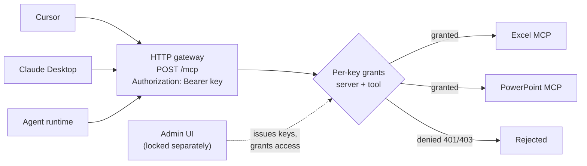

# MCP Router — access-controlled fork

A fork of [MCP Router](https://github.com/mcp-router/mcp-router) that turns the local
aggregator into something a team can point several machines at: per-key permissions on
individual MCP servers and tools, expiring Bearer keys, a desktop admin lock, and a
white-label branding layer so a deployment can carry its own name and colours.

Upstream aggregates MCP servers and exposes them to local clients. That model assumes one
trusted user at one desktop. The moment the HTTP gateway is reachable from other machines,
"whoever holds the URL gets every tool" stops being acceptable — which is what this fork
is about.



---

## What this fork adds

### Per-key access control

A key is not an all-access pass. Each key carries an explicit grant list: which MCP servers
it may reach, and which tools within them.

- **New keys start with nothing granted.** Access is added deliberately, not revoked after the fact.
- **Tool lists are cached**, so permissions can be granted against a server that is currently powered off. Execution still requires it to be LIVE — the cache decides what you can *grant*, never what you can *run*.
- Denied calls fail at the gateway, before the request reaches the server.

### Expiring keys

Keys default to a 30-day lifetime, selectable at issue time (1 day, 1 week, 30 days, 90 days,
custom, or never). Expired keys are rejected on `/mcp` and cannot list or call tools. Keys
issued before expiry enforcement was added stay valid until reissued, so turning this on does
not lock out a running deployment.

### Desktop admin lock

First launch creates a local administrator; the password is stored as an argon2 hash. Later
launches show an unlock screen.

The lock covers the **UI, not the service** — locking the window does not stop the HTTP
gateway. That is deliberate: on a shared machine you want the console locked while clients
keep working. Lost password recovery is documented and local-only.

### White-label branding

One config file sets the application name, window title, wordmark, icon and accent colour.
The default build is unbranded — no organisation's marks ship in this repository.

```json
{
  "appName": "MCP Router",
  "colors": { "accent": "#2563eb", "foreground": "#1f2937" },
  "logo": "public/images/brand/logo.svg",
  "mark": "public/images/brand/mark.svg"
}
```

Drop in your own SVGs and the title bar, installer metadata and theme follow. See
[`docs/BRANDING.md`](docs/BRANDING.md).

> Use only marks you have the right to use. Do not commit a third party's logo artwork.

---

## Where the code comes from

This repository has three layers, and `git log` separates them:

| Layer | |
|---|---|
| **Upstream** | [mcp-router/mcp-router](https://github.com/mcp-router/mcp-router) by fjm2u — the Electron app, the aggregator, projects, tool catalog, cloud sync. The large majority of the code. |
| **Remote-deployment path** | The Windows/Azure packaging workflow and the initial agent HTTP client wiring were contributed by a collaborator during the same internship. |
| **Access control** | Per-key server and tool grants, cached tool lists, Bearer key expiry, the desktop admin lock, and the branding layer. Mine — `git log --author=Xr810`. |

The upstream project's licence and attribution are preserved. This fork is not affiliated
with or endorsed by the upstream authors.

---

## Run it

Packaged builds for macOS and Windows are on the **Releases** page. They carry
`LICENSE.md` and `NOTICE` as attachments; the macOS build is unsigned unless signing
credentials were configured for the run.

To run from source:

```bash
pnpm install
pnpm dev
```

Package a desktop build yourself:

```bash
pnpm --filter @mcp_router/electron make
```

Cut a release by pushing a tag — `.github/workflows/release.yml` builds both platforms and
drafts a release for you to review and publish.

Clients connect over HTTP:

```text
POST http://HOST:3282/mcp
Authorization: Bearer <key issued in the Keys panel>
```

Local clients on the same machine can still use localhost directly.

For deploying the gateway on a remote VM — including getting a packaged build onto a
machine too small to run a webpack build — see
[`docs/REMOTE_DEPLOYMENT.md`](docs/REMOTE_DEPLOYMENT.md).

---

## Licence

Upstream's licence applies; see `LICENSE.md`. Additions in this fork are released under the
same terms.

That licence is the **Sustainable Use License**, which is not an open-source licence. In
short — `LICENSE.md` governs, not this summary:

- Use and modify it for your own internal business purposes, or for non-commercial or
  personal use.
- Distribute it to others only free of charge and for non-commercial purposes.
- Pass the terms on to anyone who gets a copy from you.
- Modified copies must say prominently that they were modified.

This is a modified copy. `NOTICE` records what was changed, and ships inside the packaged
application alongside `LICENSE.md`.
